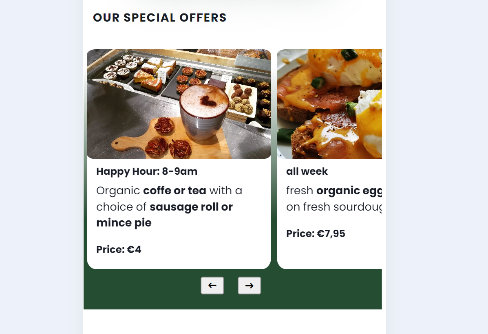

# THE ORGANIC STORE in BIRR
This is the website for the Organic Store in Birr: [ORGANIC STORE](https://troeske.github.io/OrganicStore/index.html). The store is focussing on selling the best organic products from groceries to organic soaps and coffee, sourced locally wherever possible. It is in the town Birr in Offerlay, Ireland.  

As the store does not have a Web Site up to now, it aims to provide customers with an overview of products and services, location, opening hours and guiding principles. 

The store is real as is their need for a web site and it is owned and operated by my sister and her husband.   

## User Experience

### Target Audience:
    Consumers who are looking for a store in their area to buy organic groceries and general household products.
    Consumers who find a lunch place or want a coffee.

### User Stories:
    (1) as a user I want to see what Organic Store the store caries 
    (2) as a user I want to I want to easily navigate the website on my mobile device, so that I can browse conveniently from anywhere.
    (3) as a user, I want to choose products with recyclable or refillable packaging, so that I can reduce waste and support sustainable practices.
    (4) as a user I want to receive notifications about new products, special offers, and promotions, so that I can stay informed about new arrivals and deals.
    (5) as a user, I want to learn about the Organic Store's sustainability initiatives and policies, so that I can feel confident that my interests support eco-friendly practices.
    (6) as a user, I want to easily find out when the Organic Store is open.
    (7) as a user, I want to easily find out where to Organic Store is and how I get there
    (8) as a user, I want to see what the lunch offering looks like
    
### Future Use-Cases
    (9) as a user, I want to browse the product catalogue the Organic Store sells
    (10) as a user, I want to see product reviews and ratings from other customers, so that I can make confident decisions based on the experiences of others.
    (11) as a user, I want to order products online from the Organic Store and have them delivered to my home

## Design
### Site Structure
The site implements a simple structure with the main landing page and three sub-sites for product details, the lunch menu and about us: 
. 

### Wireframes
__Mobile First approach:__

__Tablet and Desktop:__

### Imagery used
The site uses  images and photos produced/taken by the store or their suppliers. Only the hero image on the landing page is an AI generated image (https://www.freepik.com/free-ai-image/organic-farm-harvests-fresh-fruit-vegetables-generated-by-ai_42586748.htm) available for free at www.freepik.com.

### Colour Scheme
As the site is for an organic store it uses the colour green in various shades: `#132a13` as a dark background and `#63C132` for emphasize. Besides the header main text colours are white and black. 
        
### Typography
The logo is based on NouveauYearsObliqueJNL. For commercial deployment licence rights must be obtained. All other text is based on the sans-serif free Google font: Poppins.

## Features
### Existing features:
- __Navigation Bar__
The Landing Page and every sub-site shows the same Navigation/Menu Bar on top as a fixed element that allows the user to jump to any of the pages.

- __Floating Navigation Bar with Slide-Out Info__
To provide the user with a one-click option regardless of where they are on the site to see the __Opening Hours__, the __Contact Details__ as well as open a Google Maps Page with __Directions to the Store__, the site features a Floating Navigation Bar that is always visible and accessible to the user.

- __Secondary Navigation Bar through Buttons__
As a quick visual appealing overview of what products the store carries as well as a quick secondary Navigation Bar, the landing page features clickable buttons.

- __Special Offers Carousel__
To draw customers into the store and showcase the big variety of what the store has to offer the landing page displays current Special Offers in a slidable carousel implementation.

- __Footer__
The landing page and each sub-site has the same footer with social media icons and links and basic copy right.

- __Newsletter Subscription Form__
To get users to register the size features a sign-up form as part of the about sub site.

- __Social Media Icons/Link__
The Organic Store has a great presence on Instagram and Facebook. Both social media platforms a accessible through icons and respective links in the footer of each page.

- __Google Maps Link in Floating Nav Bar__
To help customer find the store in real live and navigate to it easily, the floating nav bar features a maps icon that opens a new browser tab with the route planner of Google Maps.

- __Hero Video in About Page__
To show potential customer the store and its products, there is an embedded video in the About sub site showing a walk-through of the store.

## Manual Testing
### Code Validation
W3 HTML Validator https://validator.w3.org/nu/#textarea
__Results:__
All html pages were checked by the w3 html validator and no errors remain.

CSS Validator https://jigsaw.w3.org/css-validator/validator
__Results:__
All css files were checked by the w3c css validator and no errors remainn. Remaining warnings are due to the use of css variables.

### Lighthouse Testing 

### Manual Test-Matrix

__Various Browsers on mobile and desktop devices:__

| Feature | Action | Expected Behaviour | android-chrome | android-firefox | android-edge | desktop-chrome | desktop-firefox | desktop-safari | desktop-edge | iOS safari | iOS android |
| ------- | ------ | ----------------- | ------ | ------- | ------ | ----------------- | ------ | ------- | ------ | ----------------- | ------ |
| Home Navbar | click on Logo | load landing page | ok | ok | ok | ok | ok | ok | ok | ok | ok |
| Drop Down Menu | click on hamburger menu | Hamburger menu opens | ok | ok | ok | ok | ok | ok | ok | ok | ok |
| Menu-Item: Products | click on Products in hamburger menu | Product page opens | ok | ok | ok | ok | ok | ok | ok | ok | ok |
| Menu-Item: Lunch | click on Lunch in hamburger menu | Lunch Menu page opens | ok | ok | ok | ok | ok | ok | ok | ok | ok |
| Menu-Item: About | click on About in hamburger menu | About page opens | ok | ok | ok | ok | ok | ok | ok | ok | ok |
| Menu-Item: Home | click on Products in hamburger menu | Landing page opens | ok | ok | ok | ok | ok | ok | ok | ok | ok |
| Floating Nav Bar | click on map icon | New Tab opens with Google Maps Rout Planner and Address of Organic Store preset | ok | ok | ok | ok | ok | ok |  ok | ok | ok |
| Floating Nav Bar | click on opening hours icon | Slide out appears showing the opening hours of the store | ok | ok | ok | ok | ok | ok | ok | ok | ok |
| Floating Nav Bar | click on contact details icon | Slide out appears showing the address, email and phone number of the store | ok | ok | ok | ok | ok | ok | ok | ok | ok |
| Secondary Nav on Landing Page | Click on either of the shown products | jump to products sub-site and section of the selected product | ok | ok | ok | ok | ok | ok | ok | ok | ok |
| Special Offers Carousel | thumb slide through the available Offers | Offers carousel shows the next special offer | ok | ok | ok | ok | ok | ok | ok | ok | ok |
| Special Offers Carousel | click/tab the '<previous>' '<next>' button below offer cards to go through the available Offers | Offers carousel shows the next special offer | ok | ok | ok | ok | ok | ok | ok | ok | ok |
| Footer | Click on the social media icons | Jump to the Facebook or Instagram page of the Organic Store | ok | ok | ok | ok | ok | ok | ok | ok | ok |
| Newsletter Subscription | click on 'Subscribe' button in the Newsletter Subscription Form | Code Institute page opens showing the input data | ok | ok | ok | ok | ok | ok | ok | ok | ok |
| Newsletter Input Validation | Click on 'Subscribe' with no input on First Name | Info appears to fill out the field and submit is blocked| ok | ok | ok | ok | ok | ok | ok | ok | ok |
| Newsletter Input Validation | Click on 'Subscribe' with no input on Last Name | Info appears to fill out the field and submit is blocked| ok | ok | ok | ok | ok | ok | ok | ok | ok |
| Newsletter Input Validation | Click on 'Subscribe' with no input on eMail | Info appears to fill out the field and submit is blocked| ok | ok | ok | ok | ok | ok | ok | ok | ok |
| Newsletter Input Validation | Click on 'Subscribe' with no @ in the eMail field  | Info appears to provide an @ in this field and submit is blocked| ok | ok | ok | ok | ok | ok | ok | ok | ok |
| Hero Video in About Page | scroll to video | video is auto playing | ok | ok | ok | ok | ok | ok | ok | ok | ok |
| external links on landing page | click on external link | external link opens in separate tab | ok | ok | ok | ok | ok | ok | ok | ok | ok |
| external links on products page | click on external link | external link opens in separate tab | ok | ok | ok | ok | ok | ok | ok | ok | ok |
| external links on about page | click on external link | external link opens in separate tab | ok | ok | ok | ok | ok | ok | ok | ok | ok |
| Rendering of landing page | load landing page | page shows as deseigned | ok | ok | ok | ok | ok | ok | ok | Guiding Principle not rendered correctly | Guiding Principle not rendered correctly |
| Rendering of products page | load products page | page shows as deseigned | ok |ok | ok | ok | ok | ok | ok | ok | ok |
| Rendering of lunch page | load lunch page | page shows as deseigned | ok |ok | ok | ok | ok | ok | ok | ok | ok |
| Rendering of about page | load about page | page shows as deseigned | ok |ok | ok | ok | ok | ok | ok | ok | ok |

### Open Issues
__iOS - Chrome and iOS - Safari:__
h2 headings in the Guiding Principles Section on the landing page do not format correctly. 

## Deployment
This section should describe the process you went through to deploy the project to a hosting platform (e.g. GitHub) 

The site was deployed to GitHub pages. The steps to deploy are as follows: 
  - In the GitHub repository, navigate to the Settings tab 
  - From the source section drop-down menu, select the Master Branch
  - Once the master branch has been selected, the page will be automatically refreshed with a detailed ribbon display to indicate the successful deployment. 

The live link can be found here: https://troeske.github.io/OrganicStore/index.html 

## Credits
### Tutorials
https://www.youtube.com/@KevinPowell

### Code
https://www.w3schools.com/
https://developer.mozilla.org/en-US/
https://css-tricks.com/snippets/css/complete-guide-grid/#aa-introduction
https://css-tricks.com/snippets/css/a-guide-to-flexbox/
Copilot / ChatGPT

### Graphics
icons: https://fontawesome.com/
hero picture: https://www.freepik.com/free-ai-image/organic-farm-harvests-fresh-fruit-vegetables-generated-by-ai_42586748.htm
favicon: https://www.freepik.com/icon/organic_5486286?sign-up=email#uuid=ddb9efcc-27f4-423c-b270-77de44691f5b
colour-schemes: https://coolors.co/

### Photos
https://www.instagram.com/theorganicstorebirr?utm_source=ig_web_button_share_sheet&igsh=ZDNlZDc0MzIxNw==

### Text Content
my own text supported by ChatGPT

### Any other resources
https://validator.w3.org/nu/#textarea
https://jigsaw.w3.org/css-validator/validator

