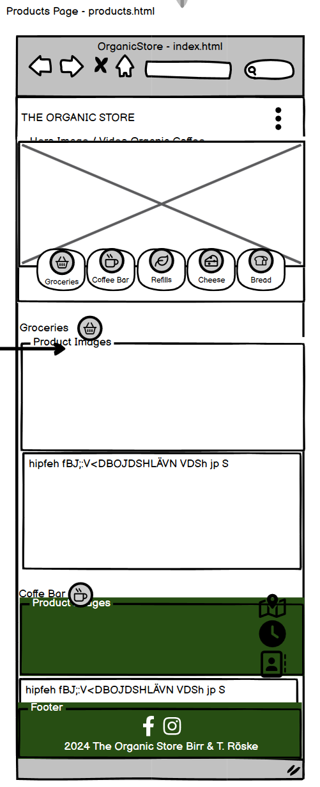

# THE ORGANIC STORE in BIRR
    This is the website for the Organic Store in Birr: . The store is focussing on selling the best organic products from groceries to organic soaps and coffee, sourced locally wherever possible. It is located in the town Birr in Offerlay, Ireland.  
    
    As the store does not have a Web Site up to now, it aims to provide customers with an overview of products and services, location, opening hours and guiding principles. 
    
    The store is real as is their need for a web site and it is owned and operated by my sister and her husband.   

## User Experience

    Target Audience:
        Consumers who are looking for a store in their area to buy organic groceries and general household products
        Consumers who find a lunch place or want a coffee

    User Stories:
        (1) as a user I want to see what Organic Store the store caries 
        (2) as a user I want to  I want to easily navigate the website on my mobile device, so that I can browse conveniently from anywhere.
        (3) as a user, I want to choose products with recyclable or refillable packaging, so that I can reduce waste and support sustainable practices.
        (4) as a user I want to receive notifications about new products, special offers, and promotions, so that I can stay informed about new arrivals and deals.
        (5) as a user,  I want to learn about the Organic Store's sustainability initiatives and policies, so that I can feel confident that my interests support eco-friendly practices.
        (6) as a user, I want to easily find out when the Organic Store is open.
        (7) as a user, I want to easily find out where to Organic Store is and how I get there
        (8) as a user, I want to see what the lunch offering looks like
        
        future use cases
        (9) as a user, I want to browse the product catalogue the Organic Store sells
        (10) as a user, I want to see product reviews and ratings from other customers, so that I can make confident decisions based on the experiences of others.
        (11) as a user, I want to order products online from the Organic Store and have them delivered to my home

## Design
    ### Site Structure
        The site implements a simple strcuture with the main lanmding page and three sub-sites for product details, the lunch menue and about us: [Basic site structure] (media/Basic-Site-Structure.png). 

    ### Wireframes
        Mobile First approach:
            
            
            
            
            
            
        
        Tablet and Desktop
            
            
            
            
            
            

    ### Imagery used
        The site uses  images and photos produced/taken by the store or their suppliers. Only the hero image on the landing page is an AI generated image (https://www.freepik.com/free-ai-image/organic-farm-harvests-fresh-fruit-vegetables-generated-by-ai_42586748.htm) available for free at www.freepik.com.

    ### Colour Scheme
        As the site is for an organic store it uses the color green in various shades: #132a13 as a dark background and #63C132 for emphasize. Besides the header main text oolours are white and black. 
        
    ○ Typography
        The logo is based on NouveauYearsObliqueJNL. For commercial deploymend licence rights have to be optained. All other text is based on the sans-serif free Google font: Poppins.

## Features
    Existing features:
    - __Navigation Bar__
    The Landing Page and every sub-site shows the same Navigation/Menu Bar on top as a fixed element that allows the user to jump to any of the pages.
    
    - __Floating Navigation Bar with Slide-Out Info__
    - __Special Offers Carousel__
    - __Footer__
    - __Secondary Navigation Bar through Buttons__
    - __Newsletter Subscription Form__
    - __Social Media Icons/Link__
    - __Google Maps Link in Floating Nav Bar__
    - __Hero Video in About Page__
    - __Embedded Links to Suppliers/Partners__

## Manual Testing
    steps taken
    id bugs
    addressing potential issues

## Deployment
    guided setup
        step by step process

## Credits
    Tutorials
    code
    Graphics
    Photos
    Text Content
    Any other resources

## 
